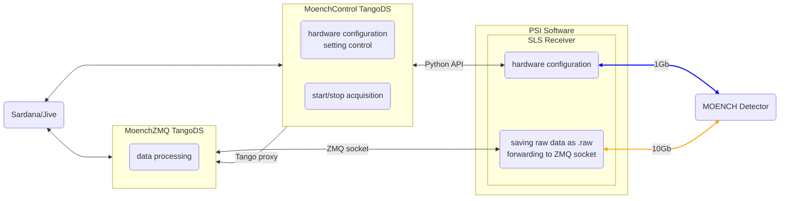

# pytango-moenchZmqServer

## Description

This device receives ZMQ packets from MOENCH detector and process them.

## Working scheme

## Installation
This package is distributed via conda. There are necessary steps before installation:
1. `conda create -n tangods_env python=3.10`
2. `conda activate tangods_env`

The package is in the mbi-div-b repository. Use the following command for installation:

`conda install -c mbi-div-b tangods_moenchzmq`

if a suitablre environment already exists you can install the package directly to it:

`conda install -n tangods_env -c mbi-div-b tangods_moenchzmq`

## Start

### manually
Start servers via commands sequence:
1. Activate the environment with installed package with: `conda activate tangods_env`.
2. Run the server with: `MoenchZmqServer INSTANCE_NAME [-v4]`

You can also give a full path to the executable:

`/home/username/miniconda3/envs/tangods_env/bin/MoenchZmqServer INSTANCE_NAME [-v4]`
### with Astor
There two necessary steps:
1. Add the following line into `StartDsPath` property of `Starter` tango DS: `/home/username/miniconda3/envs/tangods_env/bin`
2. Start the server from `Astor` window

## Help

Any additional information according to slsDetector, its python API or pytango references can be found under the links:

* [slsDetectorGroup wiki](https://slsdetectorgroup.github.io/devdoc/pydetector.html)
* [pytango reference](https://pytango.readthedocs.io/en/stable/)

## Authors

Contributors names and contact info

[@lrlunin](https://github.com/lrlunin)

## Version History

## License

This project is licensed under the MIT License - see the LICENSE.md file for details

## Acknowledgments
* Anna Bergamashi
* Erik @erikfrojdh Fröjdh
