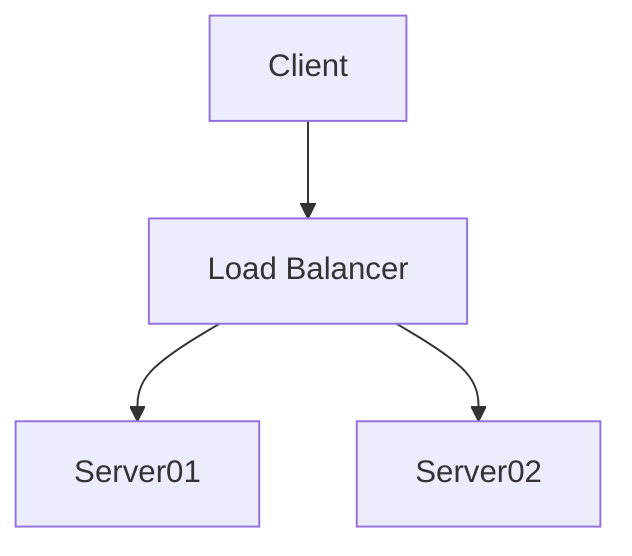

# **Welcome to MOENCH ZMQ TangoDS documentation!**


## Commands



```python
def function(self, a : str):
    print(self.test(a))

```

## Project layout

    mkdocs.yml    # The configuration file.
    docs/
        index.md  # The documentation homepage.
        ...       # Other markdown pages, images and other files.


